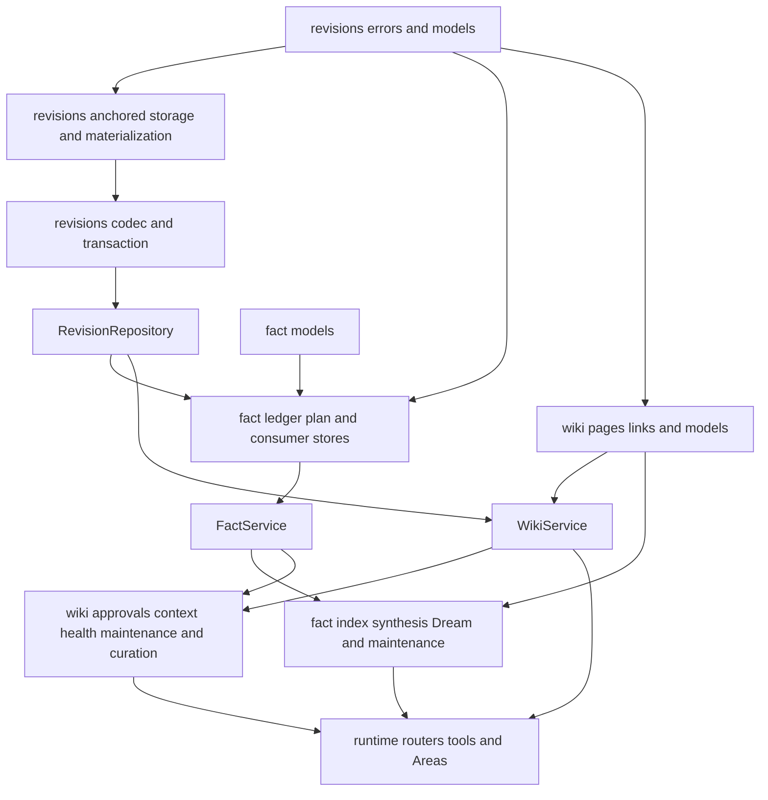
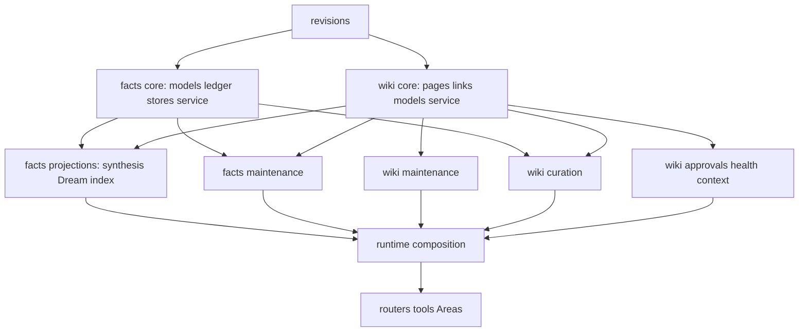

# Wiki and memory dependency graph

Generated from static Python imports on 2026-07-28. Scope:

- `arden.revisions`
- `arden.memory.facts`
- `arden.wiki`
- their direct runtime, router, tool, and Area consumers

The final AST graph covers all 315 `arden` modules and 1,200 import edges. It
has no strongly connected component. Production and tests contain no
`TYPE_CHECKING` or postponed-annotation imports.

## Current graph

The problematic edges are not domain cycles. They come from eager package
barrels:

- `arden.memory.facts.__init__` imports almost the complete fact subsystem.
- `arden.wiki.__init__` imports almost the complete wiki subsystem.
- importing one leaf such as `arden.wiki.models` first executes the wiki barrel,
  which loads unrelated runtime services and can re-enter the facts package.

Internal code must import leaf modules directly. Package `__init__` files should
expose only a deliberately small public boundary.

## Target graph

Rules:

1. Domain values and persistence never import runtime, routers, tools, or
   completion clients.
2. Completion adapters depend on domain request/result types; domain services
   do not depend on completion adapters.
3. Runtime is the composition root for cross-domain workers.
4. Routers and tools receive typed runtime services and do not discover them
   through nested `getattr`, `hasattr`, or silent `None` fallbacks.
5. Maintenance and curation packages may depend on fact/wiki core services but
   never on each other.

## Baseline annotation findings

- 34 scoped modules use `from __future__ import annotations`.
- 21 scoped modules use `TYPE_CHECKING`.
- Python 3.13 is required by the server.
- Promoting all guarded imports to normal imports leaves the scoped graph
  acyclic.

Remove guarded imports first, then remove postponed annotations. Two local
declaration-order cases need an explicit move before removal:

- `SynthesisFact` in `memory/facts/synthesis.py`
- `LinkReference` in `wiki/models.py`

Do not replace postponed annotations with broad string annotations. Declaration
order and package ownership should make runtime annotations valid directly.

## Refactor order

1. Replace internal barrel imports with leaf imports.
2. Move maintenance siblings into cohesive `maintenance/` packages.
3. Move the wiki curator siblings into one `curation/` package.
4. Split the four files above 1,000 lines along read/write/domain ownership.
5. Promote typing-only imports and remove redundant future imports.
6. Replace duck-typed required-service lookup and swallowed invariant failures
   with typed dependencies and explicit errors.
7. Re-run the AST graph and import smoke tests after every move.

## 2026-07-28 simplification contract

The package moves above are complete. The remaining cleanup follows these
rules:

1. Use absolute imports throughout revisions, facts, and wiki code.
2. Keep validation at JSON, Markdown, SQLite, HTTP, and completion boundaries.
   Internal dataclasses are typed value objects and do not repeat runtime type
   validation.
3. Do not use `getattr`, `setattr`, `hasattr`, dataclass-field reflection, or
   `object.__setattr__` in these packages. Fixed schemas stay explicit.
4. Replace the maintenance completion wrapper classes with direct typed
   completion functions.
5. Flatten maintenance flow with guards and one error boundary per durable
   operation, while preserving checkpoint and retry semantics.
6. Centralize shared wiki filenames and maintenance identities. Do not add a
   generic validation or utility layer for unrelated domains.
7. Prefer explicit field comparisons, `dataclasses.replace`, and outcome
   dispatch over string-driven reflection.
8. Remove redundant one-line wrappers when their expression is clearer at the
   call site.

Verification must include the dependency graph, import smoke tests, focused
revision/fact/wiki suites, the full server suite, and a source audit for the
forbidden reflection and relative-import patterns.

## 2026-07-28 result

- All production imports are absolute.
- The event enum moved to a dependency-neutral module, removing the only
  runtime event/workflow cycle.
- Chat execution context moved below the chat service, removing its stream
  cycle.
- Tool context depends on small structural contracts rather than importing the
  concrete registry, server state, and integration implementation back upward.
- Internal revision, fact, wiki, and health dataclasses are plain value
  objects. Strict Pydantic models validate completion, SQLite, and persisted
  proposal input.
- Maintenance completion wrappers are direct functions. Runner failures
  propagate except for the explicit oversized-evidence path that creates a
  durable user review.
- Shared README, health, maintenance, and navigation identities live in
  `arden.wiki.constants`.
- Static architecture tests enforce absolute/eager imports and prohibit
  reflection in the refactored packages.

Proof: the graph reports 315 modules, 1,200 edges, and zero strongly connected
components. Ruff checks all 498 server/test Python files; the full suite passes
2,112 tests. The three existing warnings are `aiosqlite` worker-thread teardown
warnings after pytest closes an event loop.
