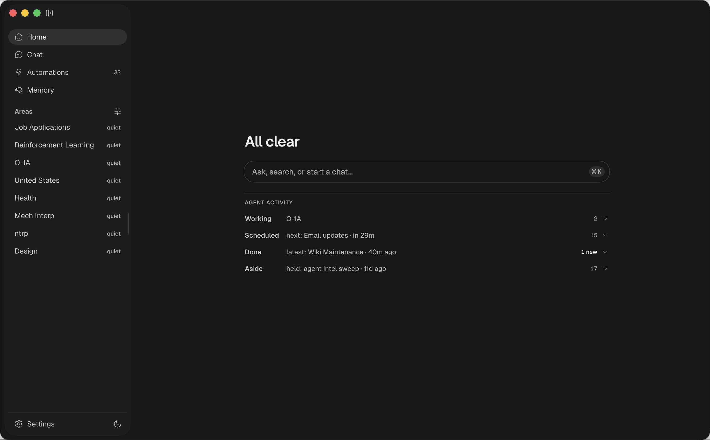
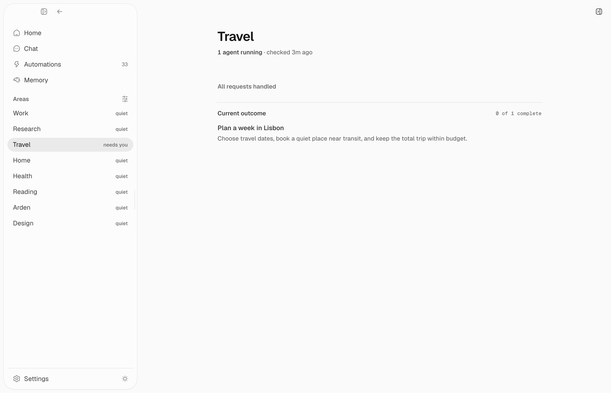

## Overview

An area is a domain of your life: an apartment hunt, your health, a side project, your finances. It may attach one managed wiki page and delegate a standing custodian. The custodian runs on its own cadence, keeps structured work and the page current, and raises only salient asks.

Home is the desktop app's landing surface. It has a composer, the focus set (each area's current ask, gathered into one list), and a strip of your areas.

The point is focus, not a feed. An area agent's job is to pick the single most important thing in its domain, or to say nothing. A quiet area is a good outcome, not a gap.

## Where areas come from

You don't register areas by hand. A daily suggester reads the unpromoted topic pages in your memory, finds the ones that look like real life domains, and offers them on Home. Accept one and Arden sets up the topic page, standing agent, channel, and room. Dismiss one and it won't be suggested again.

You can also promote a page yourself from the areas strip, or ask in chat.

## Area rooms

Open an area to get its room:

- Its active asks, with a Discuss action that replies in the custodian channel.
- Open loops: the unresolved threads the agent parses from the page's `## Open loops` section.
- The agent's status: whether it's running now, a summary of its last run, or that it hasn't run yet. That line opens the agent's channel transcript, with a Run now button next to it.
- Related areas, from the page's wikilinks.
- Activity: your own chats scoped to this area.
- A composer. A chat you start here carries the area's topic page as context, so the agent already knows the domain.

## The standing agent

An area agent is a normal automation. You'll find it in the Automations panel under Area agents, and you can edit, pause, reschedule, or run it like any other. What makes it an area agent is data on the automation, not a separate code path:

- It runs as a channel automation, so a durable session owns its runs and the full transcript is visible and replyable in the room.
- Its tool scope is an observe-only allowlist: reads plus edits to its attached managed page, nothing that acts on the outside world. See [tool scoping](/guides/tools#per-automation-tool-scoping).
- Its final `submit_area_report` action validates and atomically commits work changes, evidence, up to three salient asks, and its next-check cadence.

Every run re-decides the area's active asks. Stable ask keys update the same decision instead of creating a growing duplicate backlog.

### Observe vs act

Area agents run in observe mode by default: they read anything and update their own page, but take no external action. Act mode lets an agent run the area's own automations and workflows; irreversible actions still require approval. Toggle it from the area room.

## How this relates to memory and automations

Areas sit on top of two systems that already exist:

- [Memory](/guides/memory) is the substrate. An area may attach one managed wiki page, and the Memory view shows the same page the custodian reads and edits.
- [Automations](/guides/automations) is the engine. Area custodians are seeded channel automations with an explicit tool scope and a trusted report action.
