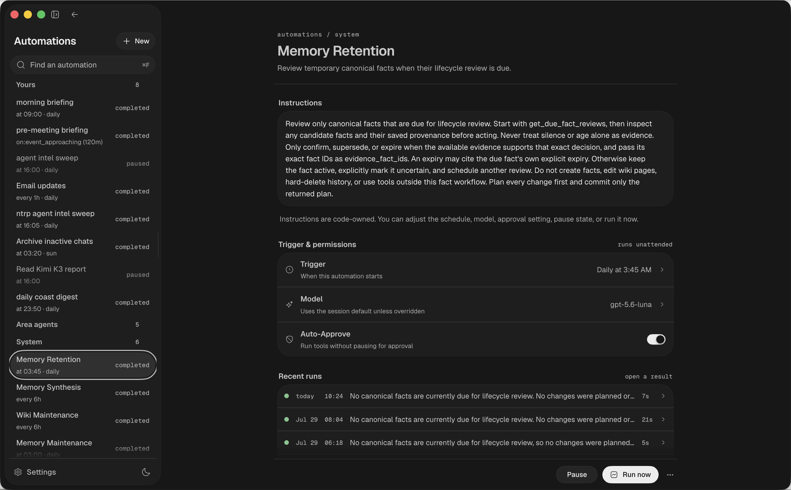

## Overview

Automations let Arden act on its own – daily summaries, inbox monitoring,
reminders, or any task you would otherwise need to start manually.

Each automation has one or more **triggers** (when to run), a standalone
**prompt** (what to do), an optional short **description** for display, and
optional notification behavior through configured notifiers. Multiple triggers
use OR logic.



## Trigger types

### Scheduled

Run at a specific time, optionally on specific days:

```
Every weekday at 09:00 → "Summarize my unread emails and calendar for today"
Every day at 22:00 → "Review what I committed today and update my work log"
```

### Interval

Run repeatedly at a fixed interval, with optional time windows:

```
Every 2h → "Check for new emails from VIP senders and notify me"
Every 30m (09:00–18:00) → "Monitor the deployment pipeline status"
```

### Event-driven

Trigger before calendar events:

```
15 minutes before any meeting → "Pull up notes about attendees from memory"
```

### Idle

Fire once after a period of user inactivity. Resets when the user sends a new
message.

```
After 5 minutes idle → "Extract facts from recent conversation"
```

### Count

Fire every N user messages in a session. The counter resets per session.

```
Every 10 turns → "Extract durable facts from the conversation"
```

### Slack message

React to new Slack messages in named channels. Use this for a watcher instead
of polling Slack on a timer. Add a sender filter when an auto-approved
automation must not be driven by arbitrary senders.

## Automation channels

Each normal automation gets a new durable **channel session** by default. Its
runs land in a transcript you can open, read, and reply to. A loop is different:
it always attaches the current chat instead of creating a channel.

## Tool scoping

An automation can carry a **tool scope**: an allowlist of exact names or prefix
patterns such as `slack_*`. It grants write/action tools on top of the normal
read-only floor; use the narrowest scope that performs the task. `auto_approve`
skips approval only for tools already granted by that scope. See [tool scoping](/guides/tools#per-automation-tool-scoping).

## Area agents

[Area agents](/guides/areas) are channel automations seeded one per delegated area. Their explicit tool scope includes the terminal `submit_area_report` action that validates and commits work, evidence, asks, and the next-check cadence.

## Builtin automations

Arden ships with Memory Maintenance, Memory Retention, Memory Synthesis, Wiki
Maintenance, and optional Memory Dream. When managed wiki history is enabled,
Memory Storage Maintenance also prunes derived storage safely. They appear
under **System**. You can pause them, adjust their cadence, or run them now.

## Creating automations

### From chat

Use the automation tool in chat:

```
Create an automation that runs every weekday at 9am
to summarize my unread emails and today's calendar.
Notify me with the result.
```

### Via the API

```bash
curl -X POST http://localhost:6877/automations \
  -H "Authorization: Bearer $ARDEN_API_KEY" \
  -H "Content-Type: application/json" \
  -d '{
    "name": "Morning briefing",
    "prompt": "Summarize unread emails and today's calendar events. Report the briefing in the automation channel.",
    "description": "Weekday morning briefing",
    "trigger_type": "time",
    "at": "09:00",
    "days": "weekdays",
    "idempotency_key": "automation:morning-briefing",
    "idempotency_scope": "global"
}'
```

Multiple triggers:

```bash
curl -X POST http://localhost:6877/automations \
  -H "Authorization: Bearer $ARDEN_API_KEY" \
  -H "Content-Type: application/json" \
  -d '{
    "name": "Extract conversation facts",
    "prompt": "Extract durable facts from recent conversation.",
    "description": "Conversation fact extraction",
    "triggers": [
      {"type": "count", "every_n": 5},
      {"type": "idle", "idle_minutes": 10}
    ],
    "idempotency_key": "automation:extract-conversation-facts",
    "idempotency_scope": "global"
  }'
```

### Stable creation keys

Send a stable semantic `idempotency_key` with `idempotency_scope: "global"` for every standalone automation. Reuse the exact pair only when a create request has an ambiguous outcome. First list automations to find the existing producer; update it instead of creating a date- or version-suffixed duplicate. An explicit deletion releases the key so the same job can be recreated with its original identity.

## Approvals and permissions

By default, mutating or external actions still require approval. Grant only the
needed actions through `tool_scope`; toggle **auto-approve** only when those
already-granted actions must run headlessly without per-call approval.

Examples that may need auto-approve:

- sending email
- posting to Slack
- creating calendar events
- writing files or updating external systems
- creating, editing, or archiving results below `automations/` in the managed
  wiki

## Notifications

Configure notifier destinations in **Settings → Notifications** or through the notifier API. Automations can use the `notify` tool to send results to configured channels such as Telegram, email, Slack, or shell commands.
