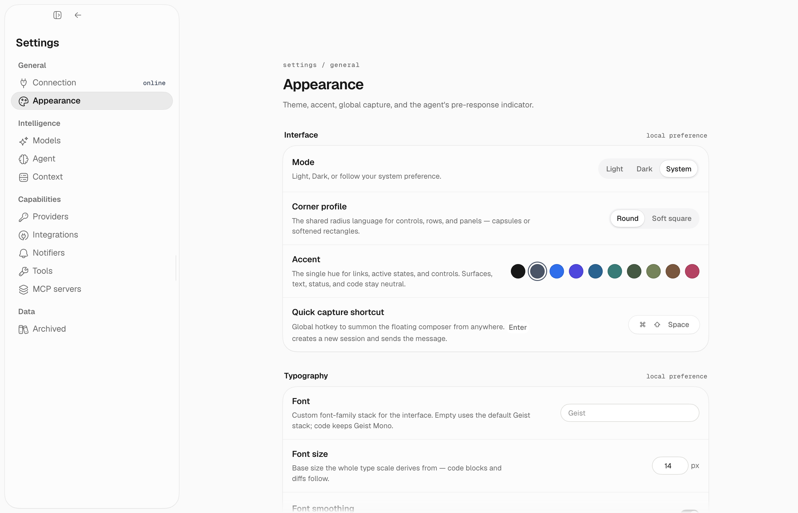

## Run from source

Install once from the repository root:

```bash
just install
```

Then start the server and desktop app in separate terminals:

```bash
just server
just desktop
```

The app connects to `http://localhost:6877` by default. Start the server first.
See [Quickstart](/quickstart) for first-time setup.

## Connect

On first launch, enter:

- **Server URL**: usually `http://localhost:6877`
- **API key**: the one-time key printed by the server

The key stays on your device. Electron encrypts it with OS-backed storage when
available.

## Main surfaces

- **Home**: start a chat, handle requests, see agent activity, and open areas.
- **Area rooms**: see the current outcome and respond to the area's standing
  agent.
- **Chat**: watch responses, tools, background agents, and approvals as they
  happen.
- **Memory**: browse pages as files or a notebook, edit them, inspect records
  and links, and restore earlier versions.
- **Automations**: manage your automations, area agents, and Arden's system
  maintenance.
- **Settings**: configure models, integrations, tools, MCP servers, directives,
  notifications, and desktop preferences.

Settings use the same searchable, grouped layout across capabilities:



## Development checks

```bash
bun run typecheck
bun test
bun run dist
```
