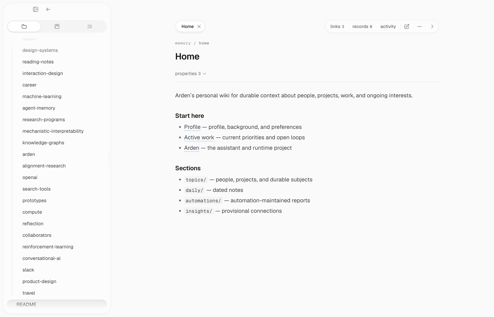

## Two parts

Arden's long-term memory has two parts:

- **Facts** hold durable, source-backed knowledge. Corrections keep their
  history and provenance.
- **Wiki pages** turn related facts and notes into readable Markdown.

Facts are the evidence. Pages are the useful view.

## Facts

Good facts include preferences, decisions, relationships, reusable procedures,
and significant events. Temporary chatter and guesses do not belong here.

Arden can create, amend, supersede, expire, or retract a fact. It never needs
to erase history to correct one.

## Wiki pages

The Memory view has two ways to browse the same pages:

- **Files** shows their managed paths and directory structure.
- **Notebook** shows page titles and a reading-oriented view.

Open a page to edit it, inspect links and cited records, or restore an earlier
revision. Agents use paths such as `topics/reinforcement-learning.md`; internal
Storage identities and revision hashes stay inside the backend.

Each directory can have a `README.md` that explains what belongs there and how
agents should use it. It is guidance, not a generated file listing.

Arden loads a small resident context from root pages such as `README.md`,
`directives.md`, `me.md`, and `profile.md` when they exist. It retrieves other
pages when they are relevant.

Interactive agents can create, edit, move, and archive ordinary pages through
the normal approval flow. Scheduled automations can write only below
`automations/` unless you grant a different supported workflow.

## Daily notes

A predefined **Daily Notes** automation runs each night and keeps one page per
day at `daily/YYYY-MM-DD.md`. It reads the day's conversations and records the
meaningful events, decisions, and context that belong to that date — not your
open work or standing facts, which live elsewhere and would only be repeated.
A day with nothing worth recording gets no page.

It is an ordinary automation: you can disable, reschedule, or edit it. Its
write path is enforced rather than merely instructed — it may create and edit
dated `daily/` pages and nothing else.

## Maintenance

Memory Maintenance reviews facts. Memory Synthesis updates fact-backed pages
from confirmed facts — it publishes only the managed regions of those pages and
no longer keeps the daily log. Wiki Maintenance keeps page structure, links,
titles, and metadata healthy. Every change is versioned and reversible.

See [Tools](/guides/tools#facts) for agent-facing memory tools and
[Facts and Wiki API](/api-reference/memory) for the server API.
