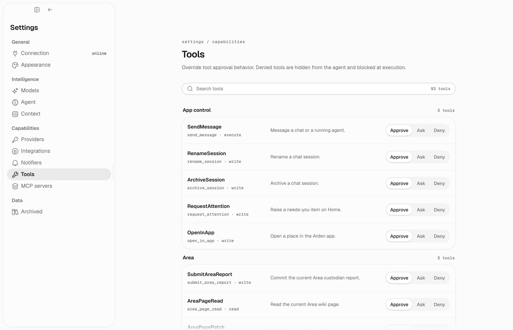

## Overview

Tools are capabilities the agent can invoke during a conversation. Some tools require your approval before executing (marked with 🔒).

Some tool schemas are **deferred**. The active harness exposes either
`load_tools` or native `tool_search` as the loader and names the required call
in the system prompt. Loading only makes a schema callable on the next model
step; it does not execute the tool or bypass approvals.

Use **Settings → Tools** to search the live catalog and choose **Approve**,
**Ask**, or **Deny** for each capability:



## System & files

| Tool | Description | Approval |
|------|-------------|----------|
| `bash` | Execute shell commands | 🔒 Dangerous commands |
| `file_read` / `file_list` / `file_find` / `file_search_text` | Inspect local files without editing them | – |
| `file_write` / `file_edit` | Create or modify local files | 🔒 |
| `current_time` | Get current date and time | – |
| `research` | Spawn a research agent with all read-only tools (`depth`: quick/normal/deep) | – |
| `workflow` | Run a curated built-in multi-agent workflow | – |
| `background` | Spawn an autonomous background agent for long-running tasks | – |
| `render_html` | Render a sandboxed rich card in desktop chat (`display` or `input` mode) | – |
| `load_tools` | Load deferred tool schemas by group or exact name | – |
| `tool_search` | Find and load exact deferred tools in native-search runs | – |
| `connection_request` | Ask you to connect one required registered integration | – |
| `directives_get` | Read persistent behavioral directives | – |
| `directives_set` | Update persistent behavioral directives | 🔒 |

File write tools and `directives_set` are deferred. The `background` tool can start new background work immediately; the `background` deferred group is only for listing, reading, or canceling existing background tasks.

## Email

Requires Gmail to be connected.

Deferred group: `email`.

| Tool | Description | Approval |
|------|-------------|----------|
| `emails` | Search and list emails | – |
| `email_read` | Read full email content | – |
| `email_send` | Send an email | 🔒 |
| `email_reply` | Reply in an existing thread by qualified `account:message_id` | 🔒 |

## Calendar

Requires Google Calendar to be connected.

Deferred group: `calendar`.

| Tool | Description | Approval |
|------|-------------|----------|
| `calendar` | Search and list events | – |
| `calendar_create_event` | Create an event | 🔒 |
| `calendar_edit_event` | Edit an event | 🔒 |
| `calendar_delete_event` | Delete an event | 🔒 |

## Google Drive

Requires Google Drive to be connected.

Deferred group: `google_drive`.

| Tool | Description | Approval |
|------|-------------|----------|
| `drive_search` | Search Docs and Sheets | – |
| `drive_read_doc` | Read a Google Doc | – |
| `drive_read_sheet` | Read a bounded A1 range | – |
| `drive_create_doc` / `drive_create_sheet` | Create an empty document or sheet | 🔒 |
| `drive_edit_doc` | Append to or replace exact text | 🔒 |
| `drive_update_sheet` / `drive_append_sheet_rows` | Write cells or append rows | 🔒 |

## Facts

Facts are the canonical, source-backed correctness layer. Change them through
an exact plan and commit; do not use a generic memory-record mutation tool.

| Tool | Description | Approval |
|------|-------------|----------|
| `fact_search` | Search visible canonical facts; returns stable `fact_id` values. | – |
| `fact_get` | Read one fact, including lifecycle and saved provenance. | – |
| `fact_history` | Read a fact's immutable event history and provenance. | – |
| `fact_due_reviews` | List facts due for evidence-based review. | – |
| `fact_plan_changes` | Validate creates, reviews, amendments, supersessions, expiries, or retractions without publishing them. | – |
| `fact_commit_changes` | Commit one exact returned plan if its facts remain unchanged. | – |

`fact_plan_changes` returns the preview and `plan_id`; `fact_commit_changes`
accepts only that `plan_id`. The server derives authority and provenance from
the active session and Area.

## Wiki

Wiki pages are the readable, managed projection. Read before writing, then use
semantic page arguments; the backend enforces concurrency. On a conflict,
reread and retry. Scheduled automations can use generic writes only below
`automations/`; generated publishing remains reserved for an explicit owner.
This group is deferred: load it with `load_tools(group="wiki")`.

| Tool | Description | Approval |
|------|-------------|----------|
| `wiki_list_pages` | List active pages and direct child directories in one managed directory. | – |
| `wiki_list_changes` | List pages changed since a timestamp, with actor and reason. | – |
| `wiki_read_page` | Read one active page by exact managed path. | – |
| `wiki_links` | Read a page's outgoing links and backlinks. | – |
| `wiki_create_page` | Create one common page from its path, title, and body. | 🔒 |
| `wiki_edit_page` | Replace one page body by its exact managed path. | 🔒 |
| `wiki_archive_page` | Recoverably archive one page by its exact managed path. | 🔒 |
| `wiki_move_page` | Move one page by its exact managed path and rewrite its wiki links atomically. | 🔒 |
| `wiki_publish_generated` | Update one automation-owned section without touching the rest of its page. | 🔒 |

## Web

Web search uses `WEB_SEARCH` mode (`auto`, `exa`, `ddgs`, `none`). `EXA_API_KEY` is only required when mode resolves to Exa.

| Tool | Description | Approval |
|------|-------------|----------|
| `web_search` | Search the web | – |
| `web_fetch` | Fetch content from a URL | – |

## Slack

Requires Slack to be connected.

Deferred group: `slack`.

| Tool | Description | Approval |
|------|-------------|----------|
| `slack_search` | Search Slack messages | – |
| `slack_channel` | Read recent channel history | – |
| `slack_thread` | Read a message thread | – |
| `slack_channels` | List accessible channels | – |
| `slack_dms` | List open direct messages | – |
| `slack_dm` | Read a direct message conversation | – |
| `slack_users` | Search workspace members | – |
| `slack_user` | Read a user profile | – |
| `slack_file` | Read a Slack file or image by its returned reference | – |
| `slack_post_message` | Post a message | 🔒 |
| `slack_post_blocks` | Post Block Kit content | 🔒 |

## Automations

Deferred group: `automations`.

| Tool | Description | Approval |
|------|-------------|----------|
| `automation_create` | Schedule a task | 🔒 |
| `loop_create` | Start an in-chat recurring loop | 🔒 |
| `loop_schedule_wakeup` | Schedule a one-off wakeup into the current session | 🔒 |
| `loop_done` | Stop the current loop after its completion condition is met | 🔒 |
| `automation_list` | List all automations | – |
| `automation_list_runs` | List automation executions since a timestamp | – |
| `automation_update` | Modify an automation | 🔒 |
| `automation_delete` | Remove an automation | 🔒 |
| `automation_run` | Trigger immediate run | 🔒 |
| `automation_result` | Get last run result | – |

## Runtime state

| Tool | Description | Approval |
|------|-------------|----------|
| `todo_update` | Update the visible task list for complex work | – |
| `goal_get` | Read the active durable session goal | – |
| `goal_complete` | Mark the active goal complete after verification | – |
| `goal_block` | Mark the active goal blocked on missing input | – |
| `session_create` | Create a new chat/channel session | – |
| `session_list` / `session_read` / `session_search_transcripts` | Inspect readable chat history | – |
| `session_send_message` | Message a chat, or steer an agent you spawned | 🔒 (chats only) |

## App control

Available only when the active session has app-control capability.

| Tool | Description | Approval |
|------|-------------|----------|
| `session_rename` | Rename a chat or agent session | 🔒 |
| `session_archive` | Archive finished sessions | 🔒 |
| `app_request_attention` | Add a needs-you item to Home | 🔒 |
| `app_open` | Open a supported resource in the desktop app | 🔒 |

These are mostly internal coordination tools. The desktop app exposes the visible results as todos, channels, session history, and status updates.

## Background tasks

Deferred group: `background`.

| Tool | Description | Approval |
|------|-------------|----------|
| `agent_cancel` | Stop an agent you spawned, by its session id | 🔒 |

Agents are spawned with the always-available `background` tool, which returns the
agent's own session id. Results are delivered back into the parent chat automatically;
use `session_read` to inspect an agent's work and `session_send_message` to steer it.

## Notifications

Deferred group: `notifications`.

| Tool | Description | Approval |
|------|-------------|----------|
| `notify` | Send a notification | 🔒 |

## MCP tools

Connected MCP server tools are deferred by server. Use `load_tools(group="mcp:<server>")`, for example `load_tools(group="mcp:obsidian")`. MCP tools still keep their own approval/mutation behavior after loading.

MCP tools default to conservative external execution: approval required. Per-tool config can override that with `tool_policies.<tool_name>`. If a server is trusted, `trust_tool_annotations=true` lets Arden use MCP `Tool.annotations` hints such as `readOnlyHint` and `destructiveHint`; explicit `tool_policies` still win.

## Canonical workflows

Follow the same sequence for source-of-truth work: **search → inspect → preview → mutate → verify**. Never invent IDs; pass stable refs returned by the previous tool.

### Bounded file edit

1. Find candidates with `file_find` or `file_search_text`; if `has_more` is true, narrow the query or continue with its cursor.
2. `file_read(path, offset, limit)` the exact region and retain its revision.
3. Call `file_edit` or `file_write` with that revision. The approval card shows the diff before the write.
4. Treat `write_conflict`, `not_found`, and `permission_denied` as terminal for that attempt; follow `recovery_action`, re-read, and create a new preview.
5. Verify the returned `after_ref` by reading the file again. Large results provide a durable `raw_ref` rather than disappearing at truncation.

### Slack and Gmail mutation

1. Load `slack` or `email`, search with a bounded `limit`, and continue only when the result says more may exist.
2. Inspect the selected message/thread. Use its exact `source_refs[].ref` (`channel:timestamp` for Slack, `account:message_id` for Gmail).
3. Draft the post, send, or reply; provide a stable `idempotency_key`. Approval shows the destination and bounded body preview.
4. A successful mutation returns an effect, provider receipt, and `after_ref`; an uncertain result says to verify provider state before retrying.
5. Read the returned ref to verify. For Gmail replies, `email_reply` preserves `In-Reply-To`, `References`, and Gmail `threadId`.

### MCP recovery

1. Load the exact server group with `load_tools(group="mcp:<server>")`; loading never executes a tool.
2. Inspect the lossless schema and annotations. Bound list arguments and use refs from earlier results.
3. Preview and approve external mutations unless an explicit policy says otherwise.
4. On `tool_not_loaded`, load the named group; on `mcp_error`, follow its recovery action. Do not retry uncertain mutations without checking state.
5. Preserve returned `source_refs`, `raw_ref`, receipts, and verification data for downstream calls.

## Deferred loading examples

| Need | Load call |
|------|-----------|
| Search Gmail | `load_tools(group="email")` |
| Read or edit calendar | `load_tools(group="calendar")` |
| Search Slack | `load_tools(group="slack")` |
| Browse or publish managed wiki pages | `load_tools(group="wiki")` |
| Manage automations | `load_tools(group="automations")` |
| Spawn or inspect background work | `load_tools(group="background")` |
| Send a notification | `load_tools(group="notifications")` |
| Update standing directives | `load_tools(group="directives")` |
| Use an MCP server | `load_tools(group="mcp:<server>")` |

## Skills

| Tool | Description | Approval |
|------|-------------|----------|
| `skill_use` | Activate a skill for specialized instructions | – |
| `skill_create` | Save an approved reusable global skill | 🔒 |

Obsidian should be connected as an MCP server and loaded with `load_tools(group="mcp:obsidian")` when needed.

## Approval flow

When a tool requires approval, the desktop app shows an approval card with the tool name, arguments, preview, and options to approve or reject the call. Session/tool-specific policy overrides can skip repeated approvals when you explicitly configure them.

Settings → Tools can override individual tools:

| Override | Behavior |
|----------|----------|
| Default | Use the tool's policy |
| Approve | Expose the tool and skip approval |
| Ask | Expose the tool and require approval |
| Deny | Hide the tool from the agent and block execution |

## Per-automation tool scoping

Every automation carries a **tool scope**: a named contract bounding what its
runs may touch, applied as a hard outer gate before any other selection. The
automation stores only the scope's name. The contract itself is written in
Arden's code, so no stored value pins a tool name and renaming a tool cannot
quietly narrow a saved scope.

You and the agent choose between exactly two:

| Scope | What the runs may use |
|-------|-----------------------|
| `read_only` | Every read-only tool, and nothing else. The default. |
| `all` | Every tool. Consequential calls still require approval unless auto-approve is on. |

Through the API this is the `tool_scope` field; the agent sets it with
`all_tools` on `automation_create`. Nothing else is selectable — an automation
cannot be handed a hand-written list of tool names by you or by a model.

The remaining scopes are contracts Arden assigns from code and cannot be set
from outside:

| Scope | Assigned to |
|-------|-------------|
| `area_observe` / `area_act` | [Area custodians](/guides/areas), by autonomy mode |
| `area_reply` | A custodian turn answering you — the same reach, minus the terminal report |
| `area_action` | A proposal you approved: everything internal, no outside services |
| `fact_maintenance`, `fact_retention` | Memory workers |
| `wiki_maintenance`, `wiki_producer`, `daily_notes` | Wiki workers |

This is how area agents stay observe-only: they read anything and tend their own
topic page, but take no external action. Area custodians finish by calling
`area_submit_report`. Invalid or stale reports return a tool error inside the
same agent loop, so the custodian can correct the report before the automation
is allowed to settle.

## User-defined tools

Create custom tools in `~/.arden/tools/`. Each file exports a `tools` mapping. Inputs must be bounded, failures typed, and stable results sourced:

```python
from pydantic import BaseModel, Field

from arden.agent.types.tools import ToolSourceRef
from arden.tools.core import ToolAction, ToolPolicy, ToolResult, ToolScope, tool
from arden.tools.core.context import ToolExecution


class LookupInput(BaseModel):
    query: str = Field(min_length=1, max_length=500)
    limit: int = Field(default=20, ge=1, le=100)


async def lookup(execution: ToolExecution, args: LookupInput) -> ToolResult:
    service = execution.ctx.services.get("catalog")
    if service is None:
        return ToolResult.failure(
            code="not_configured",
            message="Catalog is unavailable.",
            preview="Unavailable",
            recovery_action="Configure the catalog service and retry.",
        )
    rows = await service.search(args.query, limit=args.limit)
    return ToolResult(
        content="\n".join(row.title for row in rows),
        preview=f"{len(rows)} results",
        source_refs=tuple(
            ToolSourceRef(provider="catalog", kind="item", ref=row.id, title=row.title)
            for row in rows
        ),
    )


tools = {
    "lookup": tool(
        display_name="Lookup",
        description="Search the configured catalog and return stable item refs.",
        input_model=LookupInput,
        policy=ToolPolicy(
            action=ToolAction.READ,
            scope=ToolScope.INTERNAL,
            permissions=frozenset({"catalog"}),
        ),
        execute=lookup,
    )
}
```

Use `policy=ToolPolicy(..., requires_approval=True)` plus an `approval=` function for tools that change source-of-truth state. Use `permissions=frozenset({...})` to hide a tool unless a service is configured. Restart the server after adding or changing user tools.
