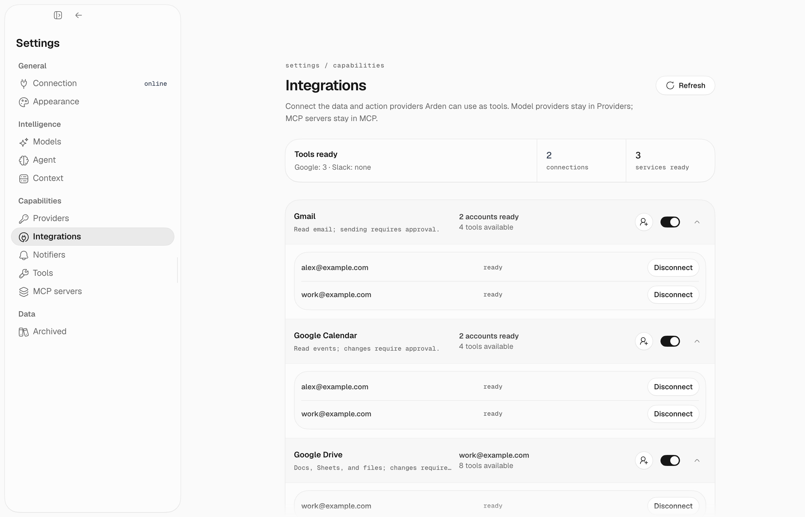

## Prerequisites

- Python 3.13+ with [uv](https://docs.astral.sh/uv/)
- [Bun](https://bun.sh) for the desktop app when running from source
- An LLM provider: Anthropic, OpenAI, Google, OpenRouter, custom OpenAI-compatible endpoint, or OpenAI account sign-in

## Install

Arden currently runs from a source checkout:

```bash
git clone https://github.com/esceptico/arden.git arden
cd arden
cp .env.example .env
just install
```

## Set up

<Steps>

### Set your LLM provider

Set one provider key in `.env`, or configure a provider in the desktop app after connecting.

```bash
# Edit .env and uncomment one:
ANTHROPIC_API_KEY=sk-ant-...
# OPENAI_API_KEY=sk-...
# GEMINI_API_KEY=...
```

If you want to use an OpenAI subscription/account instead of an API key, skip the key export and choose **OpenAI Codex** in provider onboarding. Arden opens a browser sign-in and stores refreshable OAuth tokens in `~/.arden/openai-codex-auth.json`.

### Start the server

<Tabs>
  <Tab title="From source">
    ```bash
    just server
    ```
  </Tab>
  <Tab title="Docker">
    ```bash
    docker compose up --build
    ```
  </Tab>
</Tabs>

Compose publishes the server only on `127.0.0.1` and persists Arden state in
the `arden-data` volume.

On first run, Arden generates an API key and prints it:

```
Your API key: nBx7k2...
Enter this in a desktop client to connect. It won't be shown again.
```

<Warning>Copy this key – it is only shown once. Use `uv run --project apps/server arden-server serve --reset-key` to generate a new one.</Warning>

### Start the desktop app

Desktop currently requires a source checkout. In a second terminal:

```bash
just desktop
```

Paste your API key in the connection screen. If no LLM provider is configured, provider onboarding appears so you can connect a provider and choose defaults.

### Connect integrations

Open **Settings → Integrations** to connect Gmail, Google Calendar, Google
Drive, or Slack. Use **Settings → MCP** for MCP servers.



</Steps>

## What's next?

<CardGroup cols={2}>
  <Card title="Desktop Guide" icon="desktop" href="/guides/desktop">
    Learn the app surfaces: chat, approvals, settings, memory, and traces.
  </Card>
  <Card title="Configuration" icon="gear" href="/configuration">
    Customize models, integrations, and runtime settings.
  </Card>
  <Card title="Memory" icon="brain" href="/guides/memory">
    Understand how Arden remembers things.
  </Card>
  <Card title="Connect Gmail" icon="envelope" href="/integrations/gmail">
    Let Arden read and send emails.
  </Card>
</CardGroup>
